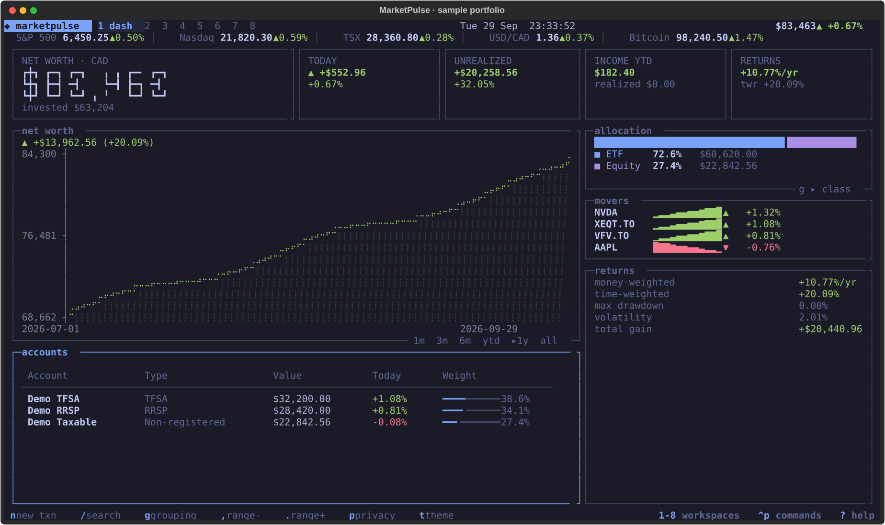

# MarketPulse

**Your portfolio, in the terminal.** A keyboard-first investment tracker with a
local ledger, market data, Canadian account support, and a native macOS menu bar companion.

[](https://github.com/BrendanH18/Marketpulse/actions/workflows/ci.yml)
[](pyproject.toml)
[](LICENSE)

[Get started](#get-started) · [User guide](docs/usage.md) ·
[Configuration](docs/configuration.md) · [Roadmap](docs/roadmap.md) ·
[Changelog](CHANGELOG.md) · [Contributing](CONTRIBUTING.md)



*The dashboard above uses fictional accounts and market data.*

## What it does

- **One portfolio ledger:** stocks, ETFs, crypto, cash, GICs, bonds, and manually
  valued assets across registered and taxable accounts.
- **Portfolio analysis:** net worth, allocation, income, money-weighted returns
  (XIRR), time-weighted returns, drawdown, and volatility.
- **Canadian account support:** TFSA, RRSP, FHSA, RESP, and other account types;
  contribution-room tracking and estimated capital gains using pooled ACB.
- **A terminal workspace:** eight views, braille charts, a command palette,
  watchlists, price alerts, and bundled Omarchy themes.
- **Scriptable commands:** CSV import and export, JSON status, backups, and
  integrations for Waybar, tmux, and macOS.
- **Local storage:** one SQLite database, four direct runtime dependencies,
  no MarketPulse account, and no application telemetry.

MarketPulse records transactions you enter or import. It does not connect to
your brokerage or place trades. Quotes may be delayed, and tax reports are
estimates; review them against your own records before relying on them.

## Get started

You need **Python 3.11+**, [uv](https://docs.astral.sh/uv/getting-started/installation/),
and a terminal with Unicode and color support. Linux and macOS are the primary
platforms; the menu bar companion requires macOS 14+ and the Xcode Command Line Tools.

Install from a source checkout:

```bash
git clone https://github.com/BrendanH18/Marketpulse.git
cd Marketpulse
uv tool install --python 3.11 --editable .
marketpulse --version
```

Both `marketpulse` and `mp` launch the same application. If the command is not
found, run `uv tool update-shell` and open a new terminal.

Create an account and record your first transaction:

```bash
marketpulse accounts add "My TFSA" --type TFSA
marketpulse buy XEQT.TO 20 30.00 --account "My TFSA" --date 2024-01-02
marketpulse
```

This example records a historical purchase at CAD 30 per share. Replace it with
your own transaction details. Omit the price to record a purchase at the current
quote. Accounts track holdings by default; add `--track-cash` if you also want
deposits, purchases, and sales reflected in a cash balance.

To explore the importer with fictional data in a separate portfolio:

```bash
MARKETPULSE_DATA="$PWD/.marketpulse/demo" marketpulse accounts add "Demo TFSA" --type TFSA --track-cash
MARKETPULSE_DATA="$PWD/.marketpulse/demo" marketpulse accounts add "Demo Taxable" --type NONREG
MARKETPULSE_DATA="$PWD/.marketpulse/demo" marketpulse import examples/transactions.csv --dry-run
MARKETPULSE_DATA="$PWD/.marketpulse/demo" marketpulse import examples/transactions.csv
MARKETPULSE_DATA="$PWD/.marketpulse/demo" marketpulse
```

The demo uses your normal display configuration and fetches current market data.
Its portfolio is separate from your default database.

### Updating

Quit the TUI and menu bar companion, then update from your checkout:

```bash
marketpulse backup
git pull --ff-only
uv tool install --python 3.11 --editable --reinstall .
```

Re-run `marketpulse menubar install` to rebuild an installed companion.

## Find your way around

Run `marketpulse` to open the TUI. Press `?` for help or `ctrl+p` for the command palette.

| Key | Workspace | What you can do |
| --- | --- | --- |
| `1` | Dashboard | View net worth, allocation, returns, and market movers |
| `2` | Holdings | Browse positions, account filters, and recent activity |
| `3` | Watchlist | Follow symbols, sparklines, and 52-week ranges |
| `4` | Chart | Explore price history and compare symbols |
| `5` | Activity | Add, edit, delete, import, and export ledger entries |
| `6` | Income | Review dividends, interest, and estimated future income |
| `7` | Accounts | Manage accounts, assets, contribution room, and tax estimates |
| `8` | Alerts | Manage price and percentage-change notifications |

Common shortcuts: `b` buy, `s` sell, `/` search, `r` refresh, `p` privacy mode,
`t` next theme, and `q` quit. See the [user guide](docs/usage.md) for workspace shortcuts.

## Use it from the command line

```bash
marketpulse summary
marketpulse holdings --account "My TFSA"
marketpulse chart NVDA --period 1y --vs QQQ
marketpulse perf
marketpulse income
marketpulse tax --year 2025
marketpulse import activities.csv --account "My TFSA" --dry-run
marketpulse export ledger.csv
marketpulse backup
```

Use `marketpulse --help` to list commands and `marketpulse <command> --help`
for arguments and options. The [user guide](docs/usage.md) covers cash tracking,
manual assets, transfers, contribution room, alerts, and integrations.

## macOS and Omarchy

On macOS, install the native SwiftUI companion from your editable checkout:

```bash
xcode-select --install  # if the Command Line Tools are not installed
marketpulse menubar install
```

The companion shows portfolio status in the menu bar and a popover with accounts,
movers, charts, and alerts. Press `⌥⌘M` to open the TUI. Settings include display
mode, refresh interval, terminal selection, and launch at login.

On Omarchy, `theme = "auto"` follows your active theme. Elsewhere, it defaults
to Tokyo Night. Select a bundled palette with `marketpulse theme set kanagawa`.
For Waybar and other status bars, see [integrations](docs/usage.md#integrations).

## Your data and configuration

| Location | Purpose | Override |
| --- | --- | --- |
| `~/.marketpulse/marketpulse.db` | Ledger, accounts, watchlist, alerts, cached quotes, and snapshots | `MARKETPULSE_DATA` sets the **directory** |
| `~/.marketpulse/backups/` | Database backups | Follows the data directory |
| `~/.config/marketpulse/config.toml` | Display and reporting settings | `MARKETPULSE_CONFIG` sets the **file**; `XDG_CONFIG_HOME` sets the default config root |

Market data requests go to Yahoo Finance's public endpoints. Your ledger is
stored locally, but symbol lookups require network access. Cached quotes can be
shown as stale when the network is unavailable.

Privacy mode masks amounts in the interface; it does not encrypt the database
or remove amounts from JSON and CSV exports. See [data and backups](docs/data.md)
for backup retention, restoration, migration, and privacy details.

Run `marketpulse doctor` to inspect your setup, or see
[configuration and troubleshooting](docs/configuration.md).

## Contribute

Bug reports, documentation improvements, and focused pull requests are welcome.
Start with [CONTRIBUTING.md](CONTRIBUTING.md) for setup, checks, architecture,
and guidance on changes to the ledger and database.

```bash
uv sync --locked --dev --python 3.11
uv run --locked ruff check .
uv run --locked ruff format --check .
uv run --locked mypy
uv run --locked pytest -q
```

The test suite uses a fake market transport and isolated data paths. CI checks
Python 3.11–3.14 on Linux, tests on macOS, builds Python distributions, and
compiles the Swift companion.

Use [GitHub Issues](https://github.com/BrendanH18/Marketpulse/issues) for bugs
and feature requests. Follow the [Code of Conduct](CODE_OF_CONDUCT.md); report
vulnerabilities through the private channels in [SECURITY.md](SECURITY.md).

## License and acknowledgments

MarketPulse is licensed under the [MIT License](LICENSE).
Bundled palettes come from [Omarchy](https://github.com/basecamp/omarchy);
see [third-party notices](THIRD_PARTY_NOTICES.md) for attribution and license terms.
The terminal interface is built with [Textual](https://github.com/Textualize/textual)
and [Rich](https://github.com/Textualize/rich).
